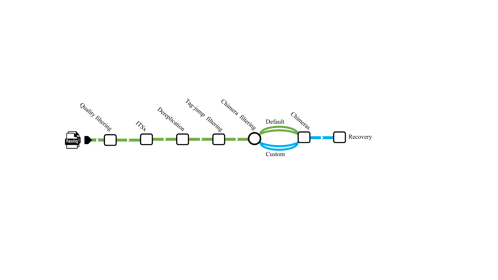

# Data and scripts for "Enhancing long-read amplicon sequencing: Overcoming chimeric sequence challenges in biodiversity studies with VSEARCH and DADA2" (Hakimzadeh et al. 2024)

### Structure
This repository contains the data and part of the analysis stack for the abovementioned paper. It is structured as follows:

[Simulated data](https://github.com/alihkz94/long-chimeric-reads-project/tree/main/Simulated%20data) holds scripts related to the simulated dataset from generating the simulated data, chimeric sequence creation, quality filtering, and chimera filtering related to the simulated dataset. Moreover, the scripts for the simulated dataset and statistical analysis were used to calculate the F1 score.

[Real data](https://github.com/alihkz94/long-chimeric-reads-project/tree/main/Real%20data) holds scripts related to real data analysis.

[BlasCh](https://github.com/alihkz94/long-chimeric-reads-project/tree/main/BlasCh) contains the BLAST scripts for alignment and specific module **BlasCh** designed for processing XML outputs to find false positive chimeras and false negative chimeras.

[Figures & tables](https://github.com/alihkz94/long-chimeric-reads-project/tree/main/Figures%20%26%20tables) contain the scripts used for generating graphs and tables.

 

The workflow we followed for the real dataset was like this:

